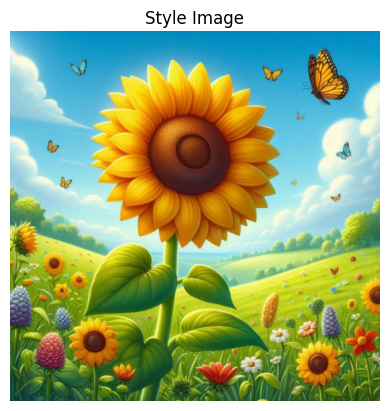
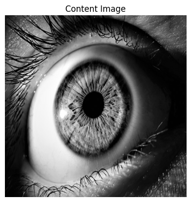
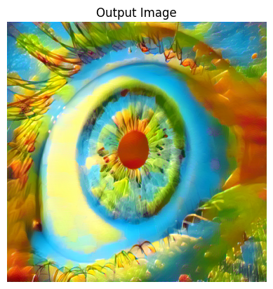
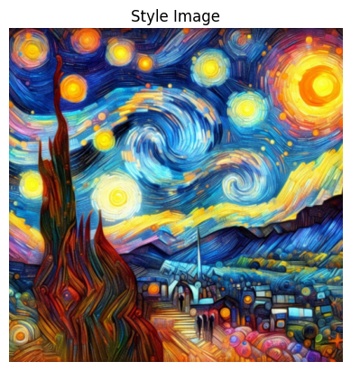
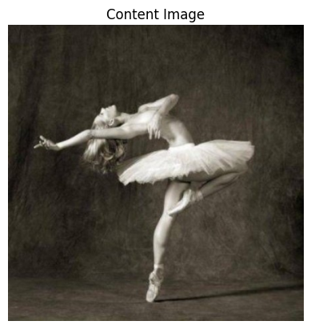
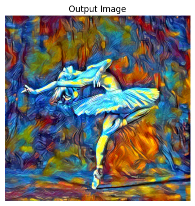
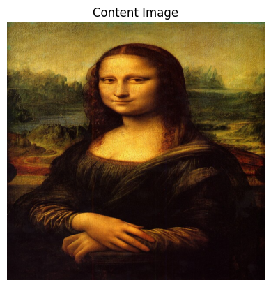
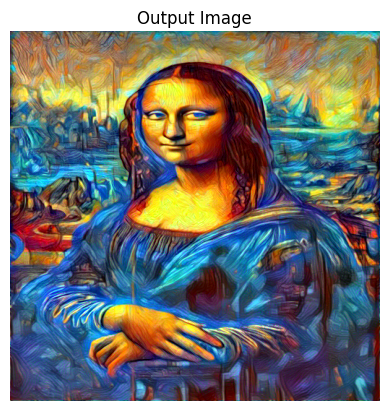

# Neural Style Transfer for Multiple Images

### What is it?

Style transfer (for multiple images) is the synthesis of images, creating an output that has the content of one image and the styles of  other images.

  
  
  

## How it Works

### Concept

The goal of neural style transfer is to minimize how different the content and style are between images. This involves taking the content of one image and blending it with the artistic style of others.

### Prerequisite Knowledge

#### Tensors
Tensors are multi-dimensional arrays, essential for storing data in neural networks. They allow the network to process and learn from the data efficiently.
- **Analogy**: Imagine one block equals one number. A row of these blocks is a vector. Stacking many rows of blocks on top of each other forms a matrix. Stacking many matrices results in a tensor.

#### GPUs vs. CPUs for Machine Learning
- **CPUs**: Good for tasks that require sequential computing and multi-threading.
- **GPUs**: Better suited for tasks that require parallel computing, like performing large scale matrix multiplications essential in neural networks.

